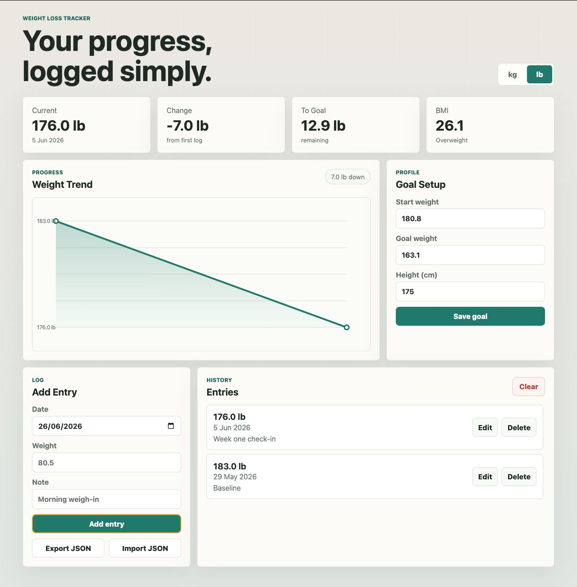

# Weight Loss Tracker

Simple privacy-first browser weight tracker with local storage, a progress chart, and JSON export.



## Overview

Weight Loss Tracker is a lightweight wellness utility for logging body weight over time without creating an account, sending data to a server, or installing dependencies. It runs entirely in the browser and keeps the experience focused on the essentials: goals, logs, progress, and portability.

This project fits well as part of a broader wellness suite because it is small, self-contained, and privacy-first by design.

## Features

- Set a starting weight, goal weight, and height
- Log dated weight entries with optional notes
- Edit or delete entries as your record changes
- View current weight, total change, remaining distance to goal, and BMI
- See progress on a responsive canvas chart
- Switch between kilograms and pounds
- Export and import tracker data as JSON
- Persist data locally with `localStorage`

## Why It Exists

Most weight trackers either require accounts or bundle tracking into a larger health platform. This app keeps the data model visible and portable, making it useful for personal tracking, wellness dashboards, and offline-first experiments.

## Tech Stack

- HTML
- CSS
- JavaScript
- Browser `localStorage`
- Canvas API

No framework, package manager, build step, or backend is required.

## Run Locally

Open `index.html` directly in a browser.

You can also serve the folder locally:

```bash
python3 -m http.server 4173
```

Then visit:

```text
http://localhost:4173
```

## Data And Privacy

All tracker data is stored in the current browser under:

```text
weight-loss-tracker:v1
```

The app does not send data anywhere. Use the JSON export/import controls to back up your entries or move them to another browser.

## Suggested Repository Metadata

Description:

```text
Simple privacy-first browser weight tracker with local storage, progress chart, and JSON export.
```

Topics:

```text
weight-loss, wellness, fitness-tracker, localstorage, vanilla-javascript, privacy-first
```
